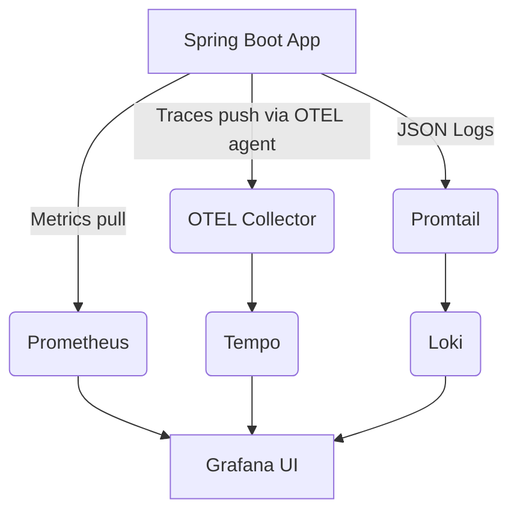

### 🖖 O11y 2.0 Example App: `enterprise-bridge`

---

#### 🚀 Overview

A Starfleet-themed Java 23 Spring Boot 3.5 app demonstrating modern observability (O11y 2.0):

- ✅ JSON logs with trace context → Loki
- ✅ Traces pushed via OTEL Java Agent → Tempo
- ✅ Metrics scraped by Prometheus from Actuator
- ✅ Unified dashboards in Grafana

---

#### 📦 Components

| Signal  | Direction | Transport              | Exported To | Notes                       |
|---------|-----------|------------------------|-------------|-----------------------------|
| Metrics | Pull      | HTTP                   | Prometheus  | Exposed via Spring Actuator |
| Traces  | Push      | OTLP/gRPC              | Tempo       | Sent by OTEL Java agent     |
| Logs    | Push      | JSON/stdout → Promtail | Loki        | Structured via logback      |

---

#### 🛠 Tech Stack

- Java 21
- Spring Boot 3.3
- OpenTelemetry Java Agent (downloaded via `devenv.nix` onEnter hook)
- Logstash Logback Encoder (version 7.4)
- Grafana, Tempo, Loki, Prometheus, OTEL Collector (via Docker Compose)

---

#### 🔍 What Does the OTEL Agent Do?

- **Instruments** HTTP calls, method calls, DB access without code changes
- **Extracts context** (trace/span IDs) and injects into logs
- **Pushes** spans to OTEL Collector over OTLP/gRPC
- **No SDK code required** — runs as a `-javaagent`

---

#### 🖼 Diagram



---

#### 🧰 Key Files

- `Dockerfile`: Runs Spring Boot app with OTEL agent
- `logback-spring.xml`: Outputs logs as JSON (via `logstash-logback-encoder`)
- `otel-collector-config.yaml`: Routes telemetry to backends
- `docker-compose.yml`: Starts Grafana/Tempo/Loki/Prometheus/OTEL Collector
- `pom.xml`: Includes Spring AOP, actuator, and observability dependencies
- `devenv.nix`: Automatically fetches the OTEL Java Agent on shell enter

---

#### 🚢 Run It

```bash
./mvnw clean package
# Use docker-compose to run everything
docker-compose up --build
```

Open:

- Grafana: http://localhost:3000 (user/pass: admin / admin)
- Explore traces, logs, and metrics in one place

---

#### 📌 Want to try alternatives?

| Area    | Alternative            | Pros                   |
|---------|------------------------|------------------------|
| Traces  | Manual @WithSpan       | Full control           |
| Logs    | Filebeat, Fluent Bit   | External log shipping  |
| Metrics | Micrometer + OTLP push | Centralized push setup |

---

🖖 *Live long and instrument.*
